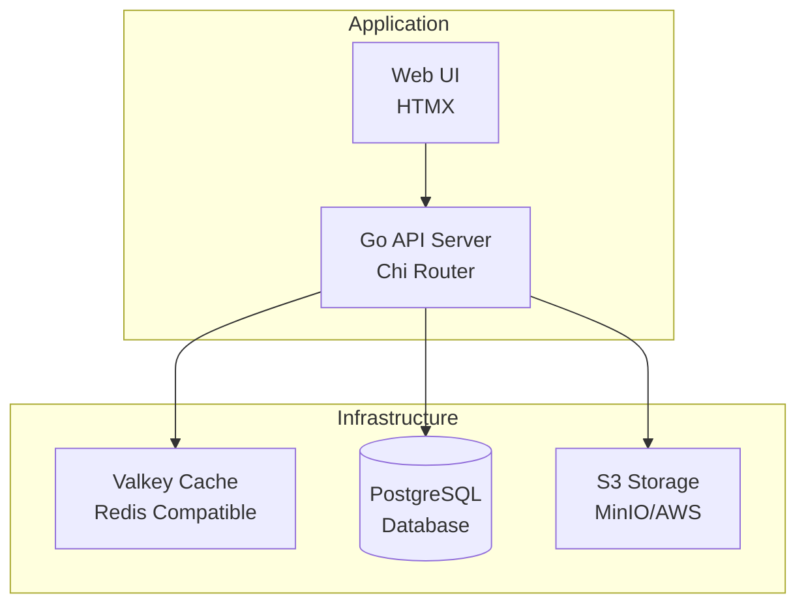

# Image Gallery

A Go image gallery application for demo purposes.

## 🏗️ Architecture



## 🚀 Quick Start

```bash
# Clone and setup
git clone <repository-url>
cd image-gallery

# Start development environment
docker-compose up -d

# Build and run
make build
./bin/server
```

## 📁 Repository Structure

```
├── cmd/server/              # Application entry point
├── internal/
│   ├── domain/             # Business logic and models
│   ├── platform/           # Infrastructure (DB, storage, cache)
│   ├── services/           # Application services
│   └── web/               # HTTP handlers and routing
├── docs/                   # Detailed documentation
├── .github/workflows/      # CI/CD pipelines
└── docker-compose.yml     # Development environment
```

## 📚 Documentation

### Development
- **[Development Guide](docs/DEVELOPMENT.md)** - Setup, commands, and local development
- **[Architecture Details](docs/ARCHITECTURE.md)** - Clean architecture and design patterns

### Operations
- **[CI/CD Pipeline](docs/DAGGER_CI.md)** - Dagger-based continuous integration
- **[Security Practices](docs/SECURITY.md)** - Security scanning and best practices
- **[Release Process](docs/DEVELOPMENT.md#-release-process)** - Automated releases with conventional commits

### Features
- **Clean Architecture** with dependency injection
- **Test-Driven Development** with comprehensive testing
- **Containerized CI/CD** using Dagger
- **Multi-platform Support** (Linux, macOS, ARM64, AMD64)
- **Security-First** approach with vulnerability scanning

## 🛠️ Technology Stack

- **Runtime**: Go 1.25
- **Database**: PostgreSQL with Atlas migrations
- **Cache**: Valkey (Redis-compatible)
- **Storage**: S3-compatible (MinIO/AWS)
- **CI/CD**: Dagger with GitHub Actions
- **Testing**: Testcontainers for integration tests

## 🔧 Quick Commands

```bash
# Development
make dev                    # Hot reload development
make test                   # Run tests
make lint                   # Code linting

# Dagger CI (containerized)
make dagger-ci              # Run complete CI pipeline locally
make install-tools          # Install Dagger and other tools

# Release
make release                # Prepare and validate for release

# Infrastructure
docker-compose up -d        # Start services
make db-reset              # Reset database
```

## 📄 License

This project is licensed under the MIT License - see the [LICENSE](LICENSE) file for details.
