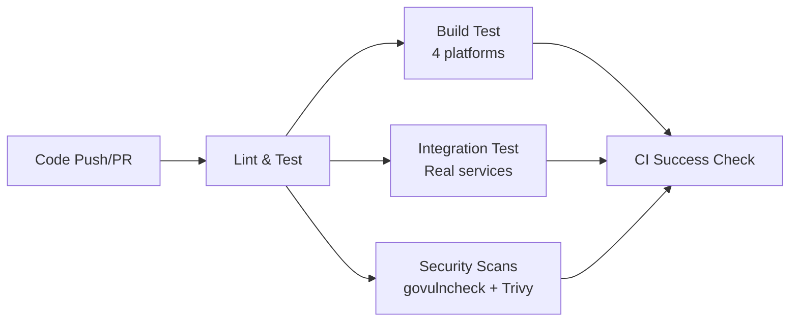
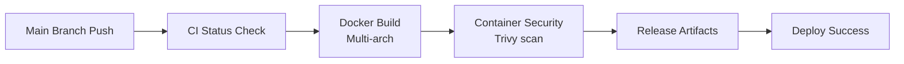

# Dagger CI/CD Pipeline

This document describes the CI/CD pipeline implementation using Dagger with existing Daggerverse modules.

## 🎯 Overview

The pipeline leverages **existing Dagger modules** from the community rather than custom modules:

- **Consistency**: Same pipeline runs locally and in CI
- **Containerization**: All operations run in isolated containers  
- **Caching**: Built-in Dagger caching for faster builds
- **Community**: Proven, maintained modules from Daggerverse

## 🧩 Dagger Modules Used

### Go Development
- **`sagikazarmark/go@v0.9.0`** - Go builds, tests, multi-platform compilation
- **`sagikazarmark/golangci-lint@v0.4.0`** - Code linting with caching

### Security Scanning  
- **`disaster37/golang@v0.0.24`** - Go vulnerability scanning (govulncheck)
- **`purpleclay/trivy@v0.11.0`** - Container and filesystem security scanning

## 🔄 Pipeline Workflows

The CI/CD is split into **two GitHub Actions workflows**:

### 1. CI Validation (`ci.yml`)
**Triggers**: All pushes and pull requests  
**Purpose**: Fast feedback and validation



**Jobs**:
- **Lint and Test**: golangci-lint, unit tests, govulncheck, Trivy filesystem scan
- **Build Test**: Multi-platform binary builds (linux/arm64, linux/amd64, darwin/arm64, darwin/amd64)
- **Integration Test**: Full environment testing with PostgreSQL, Valkey, MinIO
- **CI Success**: Status aggregation for branch protection

### 2. Build and Push (`build-push.yml`)  
**Triggers**: Main branch pushes + successful CI validation  
**Purpose**: Production builds and deployment



**Jobs**:
- **CI Status Check**: Ensures validation passed
- **Docker Build**: Multi-arch container images (linux/amd64, linux/arm64)
- **Security Scan**: Trivy container scanning with SARIF upload
- **Release Artifacts**: Build summaries and documentation
- **Deploy Success**: Status reporting and notifications

## 💻 Local Development

### Quick Start
```bash
# Install Dagger CLI and tools
make install-tools

# Run complete CI pipeline locally
make dagger-ci
```

### Individual Commands
```bash
make dagger-lint          # Code linting
make dagger-test          # Unit tests with coverage  
make dagger-vulncheck     # Go vulnerability scan
make dagger-trivy-fs      # Filesystem security scan
make dagger-build         # Cross-platform binary build
make dagger-docker        # Multi-arch container build
make dagger-trivy         # Container security scan
```

### Local Pipeline vs CI

| Command | Local | CI Equivalent |
|---------|-------|---------------|
| `make dagger-lint` | ✅ Same | CI: `lint-and-test` job |
| `make dagger-test` | ✅ Same | CI: `lint-and-test` job |
| `make dagger-ci` | ✅ Same | CI: Complete validation |

## 🔧 Pipeline Configuration

### Environment Variables
```yaml
# Required in GitHub Actions
GO_VERSION: "1.25"
REGISTRY: ghcr.io  
IMAGE_NAME: ${{ github.repository }}
```

### Dagger Module Versions
```bash
# Pinned versions for stability
sagikazarmark/go@v0.9.0
sagikazarmark/golangci-lint@v0.4.0  
disaster37/golang@v0.0.24
purpleclay/trivy@v0.11.0
```

## 🚀 Key Features

### Multi-Platform Support
```bash
# Binary builds
- linux/amd64, linux/arm64
- darwin/amd64, darwin/arm64

# Container images  
- linux/amd64, linux/arm64
```

### Security Integration
```bash
# Filesystem scanning (early detection)
dagger -m github.com/purpleclay/daggerverse/trivy@v0.11.0 call \
  filesystem --path=. --severity=HIGH,CRITICAL

# Container scanning (post-build)
dagger -m github.com/purpleclay/daggerverse/trivy@v0.11.0 call \
  image --ref=image:tag --severity=HIGH,CRITICAL --format=sarif
```

### Caching Strategy
- **Dagger Cache**: Automatic operation-level caching
- **Go Module Cache**: Persistent dependency caching
- **Container Layer Cache**: Docker layer optimization

## 📊 Pipeline Artifacts

### CI Validation Artifacts
- **Coverage Reports** (30-day retention)
- **Build Binaries** (7-day retention)  
- **Test Results** (Built-in GitHub integration)

### Build & Push Artifacts
- **Container Images** (GitHub Container Registry)
- **Security Scan Results** (30-day retention)
  - SARIF files (GitHub Security tab)
  - JSON reports (programmatic access)
- **Release Documentation** (90-day retention)

## 🔍 Monitoring & Debugging

### GitHub Integration
- **Security Tab**: SARIF vulnerability reports
- **Actions Tab**: Detailed pipeline logs
- **Packages**: Container image registry

### Local Debugging
```bash
# Verbose Dagger output
dagger -m MODULE call FUNCTION --help

# Check Dagger version
dagger version

# List module functions
dagger -m github.com/sagikazarmark/daggerverse/go@v0.9.0 functions
```

### Common Issues

#### Dagger Not Found
```bash
make install-tools  # Installs Dagger CLI
```

#### Module Version Conflicts  
```bash
# Use specific versions
dagger -m github.com/module@v1.0.0 call function
```

#### Pipeline Failures
1. Check individual job logs in GitHub Actions
2. Run equivalent `make dagger-*` command locally  
3. Verify Dagger module versions are current

## 🔄 Pipeline Updates

### Updating Dagger Modules
```bash
# Check for new versions
dagger search MODULE_NAME

# Update Makefile and workflows with new versions
# Test locally before committing
make dagger-ci
```

### Adding New Security Scans
```bash
# Example: Add SBOM generation
dagger -m github.com/module/sbom call generate --source=.
```

## 📈 Performance Metrics

### Pipeline Timing (Typical)
- **CI Validation**: 5-8 minutes
- **Build & Push**: 3-5 minutes  
- **Local `dagger-ci`**: 3-6 minutes

### Optimization Tips
1. **Parallel Jobs**: CI validation runs jobs concurrently
2. **Caching**: Dagger cache speeds up repeated operations
3. **Selective Triggers**: Build/push only on main branch

## 🔗 Related Documentation

- **[Development Setup](DEVELOPMENT.md)** - Local development with Dagger
- **[Security Practices](SECURITY.md)** - Security scanning details
- **[Architecture](ARCHITECTURE.md)** - Overall system design

## 📚 External Resources

- **[Dagger Documentation](https://docs.dagger.io/)**
- **[Daggerverse](https://daggerverse.dev/)** - Community modules
- **[GitHub Actions](https://docs.github.com/en/actions)** - Workflow documentation
